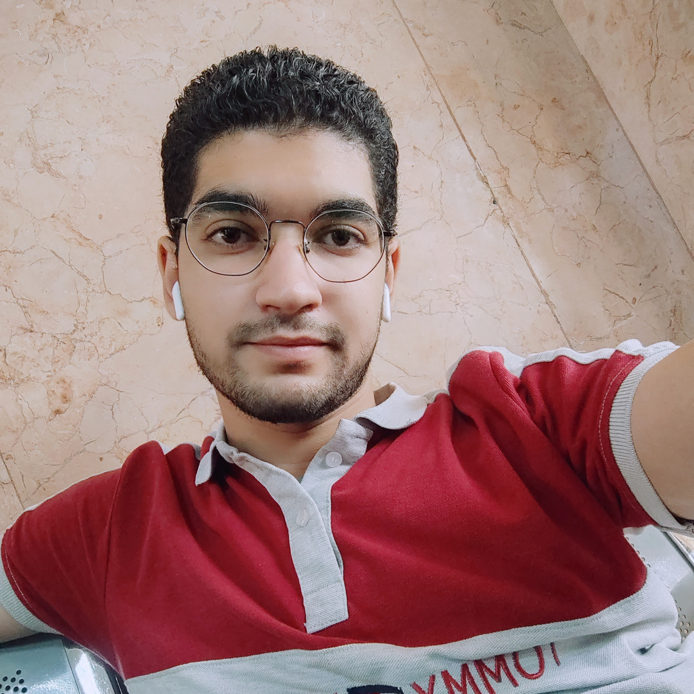

# Eslam Samir

**Phone:** +01154151932  
**Email:** eslam4ever1@gmail.com  
**LinkedIn:** [linkedin.com/in/eslam-samir-93a3b11a0](https://www.linkedin.com/in/eslam-samir-93a3b11a0)  
**GitHub:** [github.com/eslam4samir](https://github.com/eslam4samir)

---

## 🎓 Education

### Cairo University  
**Bachelor of Science in Electronics and Communication Engineering**  
Cumulative Grade: Very Good   
(_Sep. 2019 - July. 2024, Giza, Egypt_)

---

## 🏆 Graduation Project
**Static Timing Analysis EDA Tool**  
Supervised by Mabrains

- Developed an open-source Static Timing Analysis (STA) tool for integration with OpenLane digital ASIC design flow.
- Programmed the tool using Python for efficient file manipulation and utilized Linux scripting for file handling.
- The tool processes Verilog netlists post-Synthesis, converting them into a graph using NetworkX.
- Integrated timing details from Liberty `.lib` files and constraints from JSON configurations into the graph structure.
- Utilized a Breadth-First-Search (BFS) algorithm for delay calculation, ensuring accurate timing analysis and generating detailed timing condition reports.

---

## 💼 Internships

### Cad Design Intern @ Mabrains  
(_Sep 2023 – July 2024, Cairo, Egypt_)

- Standard cell library/Macro views, lib characterization. Basics Micro fabrication.
- Conducted research on electronics fundamentals, including PDK variants and extensively studied the Synopsys Liberty user guide.
- Explored the source code of EDA tools to enhance understanding and proficiency in Python, parsing information from netlists, SPICE files, and JSON configurations using Linux Shell scripting.
- Successfully executed ASIC Digital Flow using the OpenLane open-source tool across multiple projects, demonstrating expertise in digital design methodologies and tool integration.

---

## 📜 Diplomas

### **Digital Verification Diploma**  
(_Mar 2023 – May 2023, supervised by Eng. Kareem Waseem_)

- Siemens EDA simulation tool: QuestaSim.
- Hardware Description Languages: SystemVerilog.
- Constrained Random Value Generation.
- Basics of Object-Oriented Programming (OOP).
- Knowledge of communication protocols (SPI).
- Assertion-based verification and functional coverage.

**Final Project:** Verification of “Single Port RAM, SPI, FIFO”.

### **Digital IC Design Diploma**  
(_Jul 2023 – Sep 2023, supervised by Eng. Ali El-Temsah_)

- Verilog RTL Coding, Self-checking Test Benches, TCL Scripting, Static Timing Analysis.
- RTL Synthesis (Design Compiler), DFT Insertion, Formal Verification.
- ASIC Flow (Floorplanning, Pin Placement, Clock Tree Synthesis, Routing, Timing Closure).
- Post-Layout Verification.

**Final Project:** RTL to GDS Implementation of Low Power Configurable Multi-Clock Digital System.

---

## 📊 Projects

### Single Cycle MIPS Processor
- Designed and implemented a Single Cycle 32-bit RV-32I Processor (Harvard Architecture).
- Final project for Digital workshop at IEEE Cairo University Student Branch.
- The microprocessor was tested to execute Fibonacci Series.

### SPI with Dual Port RAM
- Enabled seamless communication and data transfer between the master and peripheral devices using the SPI protocol.
- Incorporated dual-port RAM for efficient and reliable data exchange.

### FIFO
- Established reliable and synchronized data transfer between different clock domains using a FIFO buffer and synchronizer circuit.
- Efficiently stored and retrieved data based on the first-in-first-out principle.

### Low Power Multi-Clock Digital System
- Received commands via UART receiver for different system functions.
- Performed register file reading/writing and ALU processing.
- Sent results and CRC bits using a 4-byte frame via UART transmitter.

---

## 💻 Technical Skills
- **Languages:** C/C++, Python, Verilog, SystemVerilog, MATLAB.
- **EDA Tools:** Openlane, Xilinx ISE, Vivado, Quartus, QuestaSim, Cadence Virtuoso, Design Compiler, ICC.
- **Others:** Git, TCL, Shell, Bash, Linux, Automation, OOP, Data Structures.

